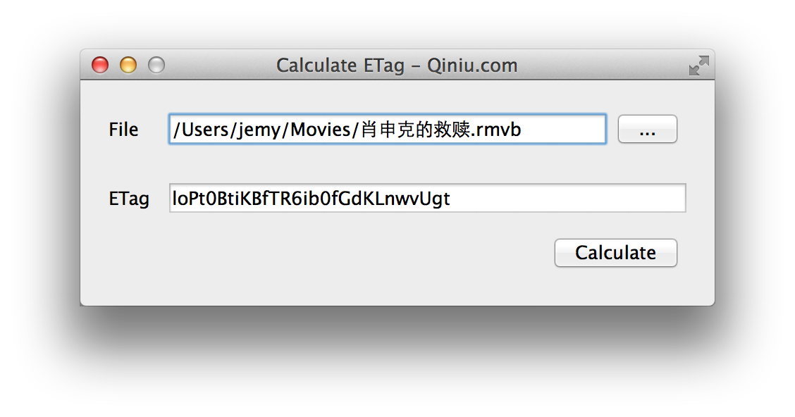

qt-qetag
========
##前言
`etag`是七牛云存储用来根据文件内容获取的唯一标识符，用来判断上传的文件是否内容重复。
你可以在[这里](https://github.com/qiniu/qetag)找到算法的具体描述和其他语言版本实现的例子。

##算法
>qetag 是一个计算文件在七牛云存储上的 hash 值（也是文件下载时的 etag 值）的实用程序。

>七牛的 hash/etag 算法是公开的。算法大体如下：

>如果你能够确认文件 <= 4M，那么 hash = UrlsafeBase64([0x16, sha1(FileContent)])。也就是，文件的内容的sha1值（20个字节），前面加一个byte（值为0x16），构成 21 字节的二进制数据，然后对这 21 字节的数据做 urlsafe 的 base64 编码。

>如果文件 > 4M，则 hash = UrlsafeBase64([0x96, sha1([sha1(Block1), sha1(Block2), ...])])，其中 Block 是把文件内容切分为 4M 为单位的一个个块，也就是 BlockI = FileContent[I*4M:(I+1)*4M]。

##用法
这是一个用Qt实现的七牛云存储计算文件etag的小项目。你可以用下面的方法来调用方法。

```cpp
QNETag x;
QString etag=x.CalcETag(fileName);
```

这里得到的`etag`就是根据七牛云存储提供的算法来得到的。在实际的项目中，可以引入`QNETag.h`和`QNETag.cpp`即可集成到你的项目中。

另外这个项目还提供了一个简单的图形化工具来方便用户测试文件的`etag`。



##开发环境
1. Qt Creator 3.2.1 (open source)
2. Based on Qt 5.3.2
